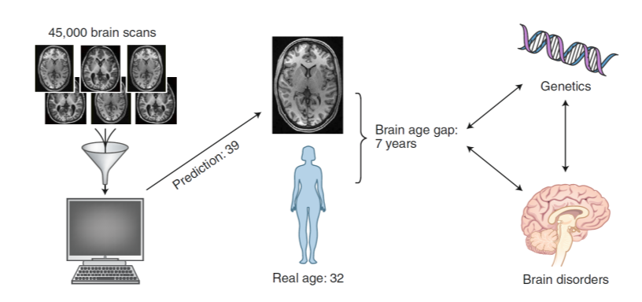

# ELMED219 - The BrainAge Challenge 2020

[elmed219-brainage](https://github.com/arvidl/elmed219-brainage/blob/master/README.md)

## Overview

### The ELMED219 BrainAge Challenge

Part of the [ELMED219](https://www.uib.no/en/course/ELMED219) course *Artificial intelligence and computational medicine*

The age of a patient is typically easy to obtain - just ask the person when they come in. So why do we want to post a brain-age challenge? Why estimate a person’s age based on images and measures from the brain? The reason is that knowledge about the correlation between actual age and age as calculated from the image data can give us insight into normal aging processes.

Knowing how a brain changes throughout adolescence and old age can tell us what each of us has to expect. Once we have an understanding of that process in healthy individuals we can look for cases in which our assumption is wrong. Say our model is - on average - able to tell us the true age given the brain images, what happens if we encounter a mismatch? Can we highlight that case and ask if this particular participant has something else going on? Maybe he is 80 years old but looks like a 40 year old person given the image data. How did the participant stay that young?

These and other questions can be posed when we have a good understanding of the normal aging process as captured by medical structured imaging. Hopefully you can help us to identify our surprising participants.

### Prerequisites

#### Install software

See [`setup.md`](https://github.com/MMIV-ML/ELMED219-2020/blob/master/setup.md) and
[`environment.yml`](https://github.com/MMIV-ML/ELMED219-2020/blob/master/environment.yml) from the ELMED2019-2020 course GitHub repository. 
Install the `Atom` editor from https://atom.io to edit and display .md files etc.

You will be working in the `elmed219`virtual environment, i.e.  
`conda activate elmed219`

**Possible additional installations:**

To install [umap](https://umap-learn.readthedocs.io/en/latest): 
`conda install -c conda-forge umap-learn`

To install [fastai](https://docs.fast.ai):
`conda install pytorch torchvision cudatoolkit=10.1 -c pytorch` 
(or if not NIVIDA / CUDA 10.1): 
`conda install pytorch torchvision -c pytorch`  
`conda install -c fastai fastai`

To install [xgboost](https://xgboost.readthedocs.io/en/latest): 
`pip install xgboost`

#### Check installation

In the `nbs` directory, run `0.0-test_setup.ipynb`

_You will work in teams. It is sufficient if one team member has the following background knowledge:_

The first part of the challenge will be given as a Kaggle InClass competition ([here](https://inclass.kaggle.com/c/elmed219-2020)). You will need a (free) [Kaggle](https://www.kaggle.com) account. See here a quick intro to Kaggle: https://www.youtube.com/watch?v=TNzDMOg_zsw.

Some basic knowledge of R, Python + Pandas or another language for statistical computing will be required. If you don’t know any of these but are still eager to join the challenge, take a look at the short [Introduction to machine learning](https://www.kaggle.com/learn/intro-to-machine-learning) and [Pandas](https://www.kaggle.com/learn/pandas) courses on Kaggle. These will be sufficient to get you started.

### References

Here are some recent discussions and reviews of brain age research:

 - Cole, J.H. and Franke, K. Predicting Age Using Neuroimaging: Innovative Brain Ageing Biomarkers, TINS, 2017, https://www.sciencedirect.com/science/article/pii/S016622361730187X
 - Bijsterbosch, J. How old is your brain? Nature Neuroscience, 2019, https://www.nature.com/articles/s41593-019-0478-0
 - Franke, K. and Gaser C. Ten Years of BrainAGE as a Neuroimaging Biomarker of Brain Aging: What Insights Have We Gained? Frontiers in Neurology, 2019, https://www.frontiersin.org/articles/10.3389/fneur.2019.00789/full

## Data description

From T1-weighted MR images of 2499 subjects (age 48.0±21.7, min 17, max 85) we have calculated 143 features. These are collected in two CSV files: train.csv and test.csv (except those kept as a hidden test set used for the "Private leaderboard" score).

Your first task is to predict the age of the subjects in the test set.

For Part 2 of the challenge, where you're tasked with telling an interesting story about your data exploration and model results, you will likely have use for additional information about the subjects, including raw images. See here for info about the SLIM, SALD, IXI and Calgary-Campinas subjects:

 - [SLIM](http://fcon_1000.projects.nitrc.org/indi/retro/southwestuni_qiu_index.html)

 - [SALD](http://fcon_1000.projects.nitrc.org/indi/retro/sald.html)

 - [IXI](https://sites.google.com/view/calgary-campinas-dataset/home)

 - [Calgary-Campinas](http://brain-development.org/ixi-dataset)

The feature names are a bit cryptic as they are from Freesurfer (6.0), which you may or may not be familiar with. We will give you a quick intro to Freesurfer during the challenge.

In the file `SLIM_longitudinal_info.csv` you will find data from 18 subjects scanned three times each. This can be used to check robustness of your brainage models, and can be part of your "Part 2 story".

You may also want to explore the raw data for your Part 2 work. You'll find all the images through the links above. Here are links to a single subject's images (anatomical and functional) and the corresponding Freesurfer 6.0 outputs. Perhaps you can make some nice visualizations?

- [SALD-sub-031529.zip](https://www.dropbox.com/s/czdtdqr5n2zwi9c/SALD-sub-031529.zip?dl=1)

- [SALD-FS60-sub-031529.zip](https://www.dropbox.com/s/zo41efu2c57ybfr/SALD-FS60-sub-031529.zip?dl=1)

### Description of the files
 - `train.csv` - training data. Consists of subject ID, some basic subject information, morphometric data and labels (age)
 - `test.csv` - test data. Same features as in the training data, except no labels.
 - `sampleSubmission.csv` - an example of a submission file following the format accepted by Kaggle. You can use this to generate your own submission.
 - `SLIM_longitudinal_info.csv` - longitudinal data. Outputs from 18 subjects scanned three times.

## Applications

### Calculating the brain age gap

Structural brain imaging features from 35,474 healthy individuals aged 3–89 years were used to train a machine-learning algorithm to determine normal trajectories of brain aging. The algorithm was then used to predict brain ages of 5,788 individuals with various brain disorders and an additional 4,353 matched healthy individuals who were not included in the training dataset. The brain age gap is defined as the difference between the brain-age prediction from the algorithm and the person’s real age. This brain age gap was found to be higher in patients with brain disorders compared with healthy individuals and was linked to genetics. (from https://doi.org/10.1038/s41593-019-0478-0)
